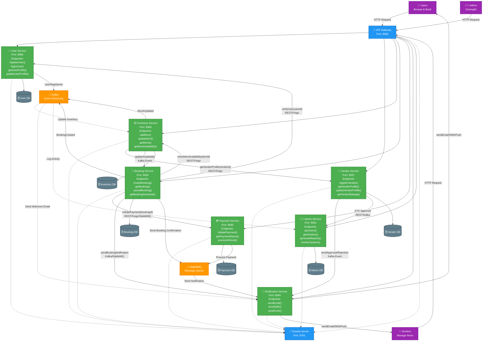

# RENTFLEX (Development In-Progress)

<div align="center">

### *Empowering Seamless Rentals, Accelerating Growth Everywhere*


### Built with the tools and technologies:


</div>

---

## 🌟 Overview

**RentFlex** is a scalable, microservices-based rental marketplace platform that enables vendors to list items and users to browse, book, and manage rentals efficiently. Built with Spring Boot, Docker, Kubernetes, Kafka, and RabbitMQ, it offers a robust environment for enterprise-grade operations.

---

## 🎯 Why RentFlex?

This project streamlines the development of multi-vendor rental systems by providing a modular, secure, and highly available architecture. The core features include:

<table>
<tr>
<td width="50%">

### 🔧 **Microservices Architecture**
Modular services for booking, vendor, user, inventory, payments, and notifications ensure scalability and maintainability.

### 🚀 **Containerized Deployment**
Built with Docker and orchestrated with Kubernetes for seamless deployment and scaling.

### 🔒 **Secure & Reliable**
Implements secure authentication, data persistence, and enterprise-grade security configurations.

</td>
<td width="50%">

### 📚 **Comprehensive API Documentation**
Simplifies integration with Swagger and API Gateway for unified API management.

### ⚡ **Real-Time Messaging**
Utilizes Kafka and RabbitMQ for efficient, event-driven communication across services.

### 🌐 **Developer-Friendly**
Supports RESTful APIs, CORS, and environment-specific configurations for smooth development and testing.

</td>
</tr>
</table>

---

## ❓ Problem Statement

People often want to **rent items (tools, vehicles, furniture, gadgets, etc.)** instead of buying, but there is **no good scalable platform** that allows vendors to list and manage rentals efficiently.

---

## 💡 Solution Overview

**RentFlex** provides a multi-vendor rental marketplace where:

<div align="center">

```
┌─────────────────────────────────────────────────────────────────┐
│                                                                 │
│  ✅  Vendors can list items with availability, pricing, terms  │
│                                                                 │
│  ✅  Customers can search, book, and manage rentals            │
│                                                                 │
│  ✅  Secure payments & booking management                      │
│                                                                 │
│  ✅  Scalable microservices architecture                       │
│                                                                 │
└─────────────────────────────────────────────────────────────────┘
```

</div>

---

## ✨ Key Features

<table>
<tr>
<td align="center" width="33%">
<br/>
<b>Multi-Vendor Support</b><br/>
Vendor registration & inventory management
</td>
<td align="center" width="33%">
<br/>
<b>Smart Booking System</b><br/>
Complete booking & scheduling with availability calendar
</td>
<td align="center" width="33%">
<br/>
<b>Secure Authentication</b><br/>
OAuth2 / JWT implementation
</td>
</tr>
<tr>
<td align="center" width="33%">
<br/>
<b>Order Management</b><br/>
Invoice generation and order tracking
</td>
<td align="center" width="33%">
<br/>
<b>Notifications</b><br/>
Email/SMS/push notifications (future scope)
</td>
<td align="center" width="33%">
<br/>
<b>Admin Dashboard</b><br/>
Monitor vendors and users
</td>
</tr>
</table>

---

## 🏗️ System Architecture (May be updated in the future.)



### 📊 Architecture Flow Explained

<table>
<tr>
<th>Step</th>
<th>Flow</th>
<th>Description</th>
</tr>
<tr>
<td>1️⃣</td>
<td>Client → Gateway</td>
<td>Users, Vendors, or Admin send HTTP requests to API Gateway</td>
</tr>
<tr>
<td>2️⃣</td>
<td>Gateway → Services</td>
<td>Gateway routes requests to appropriate microservice</td>
</tr>
<tr>
<td>3️⃣</td>
<td>Service ↔️ Service</td>
<td><b>Inter-Service Communication:</b><br/>
• User Service ↔️ Booking Service (Verify User)<br/>
• Vendor Service ↔️ Inventory Service (Get Vendor Info)<br/>
• Booking Service ↔️ Inventory Service (Check Availability)<br/>
• Booking Service → Payment Service (Initiate Payment)<br/>
• Payment Service → Booking Service (Payment Status)</td>
</tr>
<tr>
<td>4️⃣</td>
<td>Service → Database</td>
<td>Each service stores/retrieves data from its own database</td>
</tr>
<tr>
<td>5️⃣</td>
<td>Service → Kafka</td>
<td>Services publish events (e.g., "Booking Created", "Stock Updated", "User Registered")</td>
</tr>
<tr>
<td>6️⃣</td>
<td>Service → RabbitMQ</td>
<td>Services queue messages for async processing (Payments, Confirmations)</td>
</tr>
<tr>
<td>7️⃣</td>
<td>RabbitMQ → Notification</td>
<td>Notification service consumes messages to send emails/SMS</td>
</tr>
<tr>
<td>8️⃣</td>
<td>Kafka → Services</td>
<td>Services subscribe to events and react (Update Inventory, Send Emails, Log Activity)</td>
</tr>
</table>

### 🔄 Communication Patterns

| Pattern | Symbol | Usage | Example |
|---------|--------|-------|---------|
| **Synchronous (REST)** | `→` Solid Line | Direct HTTP REST calls | User Service → Booking Service |
| **Bidirectional (REST)** | `↔` Double Arrow | Two-way communication | Booking ↔ Inventory (check availability) |
| **Service Discovery** | `-.->` Dotted Line | Services register with Eureka | All services register for discovery |
| **Event Publishing** | `→` to Kafka | Asynchronous event publishing | Booking publishes "Booking Created" |
| **Event Subscribing** | `-.->` from Kafka | Services consume events | Notification subscribes to events |
| **Message Queue** | `→` via RabbitMQ | Task queuing for background work | Payment queues notification tasks |

### 💡 Real-World Example: Creating a Booking

```
1. User requests to book an item
   ↓
2. API Gateway routes to Booking Service
   ↓
3. Booking Service:
   • Calls User Service to verify user ✓
   • Calls Inventory Service to check availability ✓
   • Calls Payment Service to process payment ✓
   ↓
4. Each service saves data to its database
   ↓
5. Booking Service publishes "Booking Created" event to Kafka
   ↓
6. Payment Service queues notification message to RabbitMQ
   ↓
7. Notification Service consumes from RabbitMQ and sends email
   ↓
8. Inventory Service subscribes to Kafka and updates stock
```

---

## 🛠️ Tech Stack

<table>
<tr>
<td width="50%">

### Backend Technologies
- **☕ Java 21** - Programming language
- **🍃 Spring Boot 3.x** - Application framework
- **🔒 Spring Security** - Authentication & authorization
- **📊 Spring Data JPA** - Data access layer
- **🌐 Spring Web** - REST API development
- **✔️ Spring Validation** - Input validation

### Messaging & Events
- **📨 Apache Kafka** - Event streaming
- **🐰 RabbitMQ** - Message broker

</td>
<td width="50%">

### Database
- **🗄️ MySQL** - Primary relational database

### API & Gateway
- **🌉 Spring Cloud Gateway** - API Gateway
- **📡 Netflix Eureka** - Service Discovery

### Documentation & Testing
- **📝 Swagger/OpenAPI 3** - API documentation
- **🧪 JUnit 5** - Unit testing
- **🎭 MockMvc** - Web layer testing

### DevOps & Deployment
- **🐳 Docker** - Containerization
- **☸️ Kubernetes** - Orchestration
- **📦 Maven** - Build automation

</td>
</tr>
</table>

---

## 🔧 Microservices Breakdown

<div align="center">

| Service | Icon | Responsibility | Port |
|---------|------|----------------|------|
| **User Service** | 👤 | User registration, authentication, profile management | 8081 |
| **Vendor Service** | 🏪 | Vendor onboarding, profile, ratings, and management | 8082 |
| **Inventory Service** | 📦 | Item listings, categories, search, and availability | 8083 |
| **Booking Service** | 📅 | Rental booking, scheduling, cancellations, and history | 8084 |
| **Payment Service** | 💳 | Payment processing, invoices, and refunds | 8085 |
| **Notification Service** | 📧 | Email, SMS, and push notifications | 8086 |
| **Admin Service** | 👨‍💼 | Platform management, monitoring, and reports | 8087 |
| **API Gateway** | 🌐 | Request routing, load balancing, and authentication | 8080 |
| **Service Registry** | 📡 | Service discovery and health monitoring | 8761 |

</div>

---

## 📋 Prerequisites

Before running this project, ensure you have the following installed:

<div align="center">

| Requirement | Version | Purpose |
|-------------|---------|---------|
| ☕ **Java** | 21+ | Runtime environment |
| 📦 **Maven** | 3.8+ | Build tool |
| 🐳 **Docker** | Latest | Containerization |
| ☸️ **Kubernetes** | 1.25+ | Orchestration |
| 🗄️ **MySQL** | 8.0+ | Database |
| 📨 **Kafka** | 3.0+ | Event streaming |
| 🐰 **RabbitMQ** | 3.11+ | Message broker |

</div>

---

## 🚀 Installation & Setup

### **Method 1: Local Development**

```bash
# 1. Clone the Repository
git clone https://github.com/surajktdev/RentFlex.git
cd RentFlex

# 2. Start Infrastructure Services
docker-compose up -d mysql kafka rabbitmq

# 3. Build All Microservices
mvn clean install

# 4. Run Services (in separate terminals)
cd user-service && mvn spring-boot:run
cd vendor-service && mvn spring-boot:run
cd inventory-service && mvn spring-boot:run
cd booking-service && mvn spring-boot:run
# ... and so on
```

### **Method 2: Docker Compose (Recommended)**

```bash
# 1. Clone the Repository
git clone https://github.com/surajktdev/RentFlex.git
cd RentFlex

# 2. Build and Start All Services
docker-compose up --build -d

# 3. Check Service Status
docker-compose ps

# 4. View Logs
docker-compose logs -f [service-name]

# 5. Stop All Services
docker-compose down
```

### **Method 3: Kubernetes Deployment**

```bash
# 1. Apply Kubernetes Configurations
kubectl apply -f k8s/namespace.yaml
kubectl apply -f k8s/configmaps/
kubectl apply -f k8s/secrets/
kubectl apply -f k8s/deployments/
kubectl apply -f k8s/services/

# 2. Check Deployment Status
kubectl get pods -n rentflex
kubectl get services -n rentflex

# 3. Scale Services
kubectl scale deployment user-service --replicas=3 -n rentflex

# 4. View Logs
kubectl logs -f <pod-name> -n rentflex
```

---

## 🌐 Access Points

Once the application is running, you can access:

<div align="center">

| Service | URL | Description |
|---------|-----|-------------|
| 🌐 **API Gateway** | http://localhost:8080 | Main application entry point |
| 📝 **Swagger UI** | http://localhost:8080/webjars/swagger-ui/index.html | API Documentation |
| 📡 **Eureka Dashboard** | http://localhost:8761 | Service Registry |
| 📊 **Kafka UI** | http://localhost:9000 | Kafka monitoring |
| 🐰 **RabbitMQ Console** | http://localhost:15672 | RabbitMQ management |

</div>

**Default Credentials:**
- RabbitMQ: `guest` / `guest`
- MySQL: `root` / `password`

---

## 🐳 Docker & Kubernetes Commands

### **Docker Commands**

```bash
# Build specific service
docker build -t rentflex/user-service:latest ./user-service

# Run specific service
docker run -p 8081:8081 rentflex/user-service:latest

# View running containers
docker ps

# Stop all containers
docker stop $(docker ps -aq)

# Remove all containers
docker rm $(docker ps -aq)

# View logs
docker logs -f <container-id>
```

### **Kubernetes Commands**

```bash
# Get all resources
kubectl get all -n rentflex

# Describe a pod
kubectl describe pod <pod-name> -n rentflex

# Port forward to a service
kubectl port-forward svc/api-gateway 8080:8080 -n rentflex

# Execute command in pod
kubectl exec -it <pod-name> -n rentflex -- /bin/bash

# Delete all resources
kubectl delete namespace rentflex
```

---

## 🔮 Future Enhancements

<table>
<tr>
<td width="50%">

### 🎯 Phase 1 (Q3 2025)
- [x] Complete payment gateway integration
- [ ] Advanced search with filters
- [ ] Real-time notifications via WebSocket
- [ ] Review and rating system
- [ ] Mobile-responsive dashboard

### 🚀 Phase 2 (Q4 2025)
- [ ] Mobile app (React Native)
- [ ] AI-based recommendations
- [ ] Multi-language support
- [ ] Chat system (vendor-user)
- [ ] Analytics dashboard

</td>
<td width="50%">

### 💡 Phase 3 (2026)
- [ ] Insurance integration
- [ ] Delivery tracking system
- [ ] Dynamic pricing engine
- [ ] Vendor verification system
- [ ] Loyalty rewards program

### 🌟 Phase 4 (Future)
- [ ] Blockchain-based payments
- [ ] AR/VR item preview
- [ ] IoT device integration
- [ ] Predictive maintenance
- [ ] Global marketplace expansion

</td>
</tr>
</table>

---

## 📊 Project Status

<div align="center">


### **Current Version: 1.0.0-ALPHA**

| Component | Status | Coverage |
|-----------|--------|----------|
| User Service | ✅ Complete | 80% |
| Vendor Service | 🚧 In Progress | 70% |
| Inventory Service | 🚧 In Progress | 80% |
| Booking Service | 🚧 In Progress | 60% |
| Payment Service | 🚧 In Progress | 50% |
| Notification Service | 🚧 In Progress | 50% |
| Admin Service | 🚧 In Progress | 30% |

</div>

---

## 📄 License

This project is licensed under the **MIT License** - see the [LICENSE](LICENSE) file for details.

---

## 👨‍💻 Author

<div align="center">

### **Suraj Tiwari**

[](https://github.com/surajktdev)
[](https://www.linkedin.com/in/suraj-kumar-tiwari-javadev)
[](mailto:surajdeveloper9@gmail.com)

**Project Link:** [RentFlex](https://github.com/surajktdev/RentFlex)

</div>

---

<div align="center">

### ⭐ Star this repository if you find it helpful!

### 🔄 Fork it to create your own version!

---

**Made with ❤️ and ☕ by Suraj Tiwari**

*Empowering developers to build scalable rental marketplaces*

</div>


